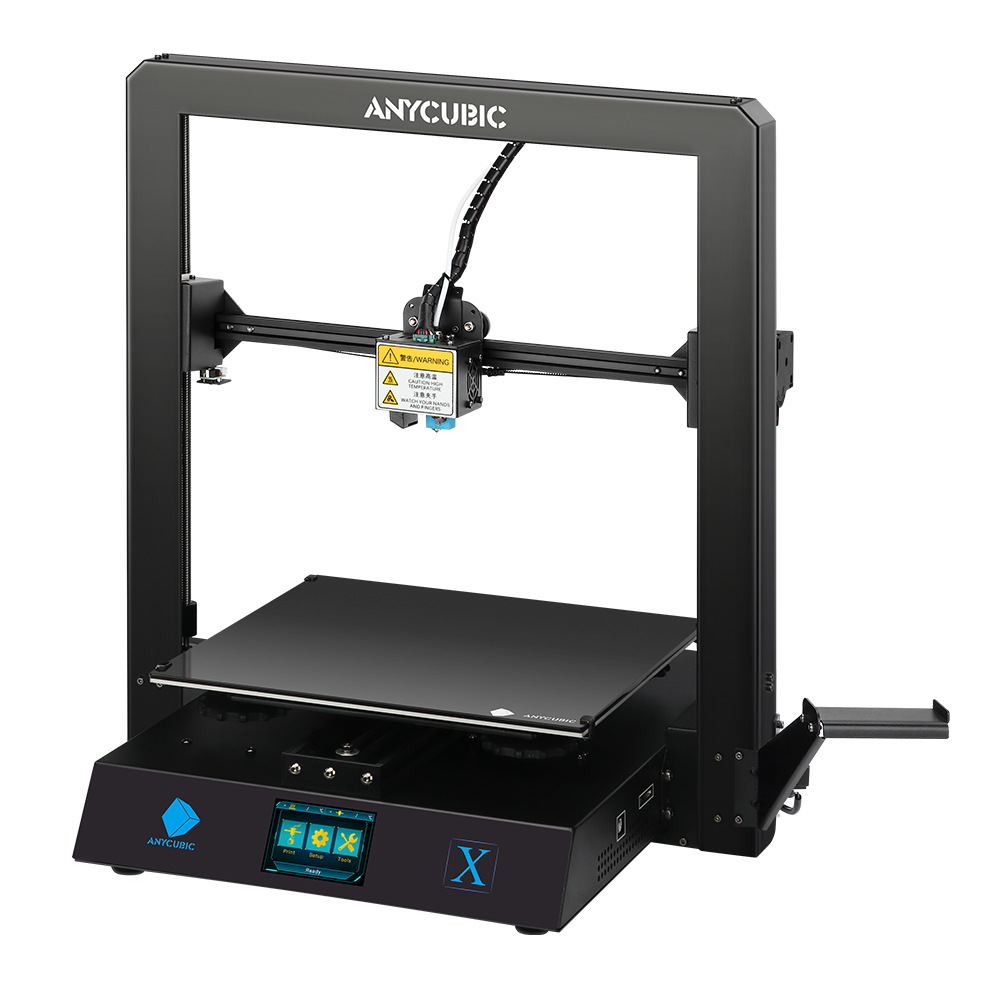
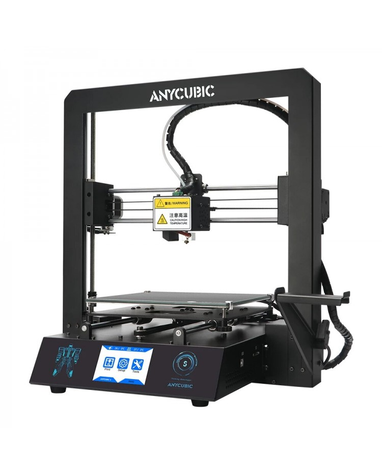

# How To 3D Drucker

Im Space haben wir mehrere 3D-Drucker. Bitte beachte die folgenden Regeln, bevor du sie verwendest:

- Die Drucker dürfen nur nach einer **Einweisung** verwendet werden, sprech uns einfach an!
- Kein Aceton auf den Druckplatten verwenden.
- Spachtel möglichst vermeiden! Nach dem Abkühlen der Druckplatte, lässt sich im Normalfall das Objekt sehr leicht lösen.
- Kein. Aceton. Niemals. Wirklich? Nein.

## Anycubic Mega X



### Anforderungen

- Nicht an den Verstellschrauben für das Heatbed drehen
- Nur mit Mesh-Leveling (Gehört in den Start-G-Code):
  ```
  M501      ; Mesh Bed Leveling (Load all saved settings from EEPROM)
  M420 S1   ; Enable leveling
  M420 Z2.0 ; Set leveling fading height to 2 mm
  ```

### OctoPrint

Unter [octopi.wwlabs.space](http://octopi.wwlabs.space) ist Octoprint zu finden. Logindaten sind `octopi/octopi`.

### Resources

- [PrusaSlicer Profil](3D_Drucker/Anycubic_MegaX/PrusaSlicer_config_MegaX.ini)

## Anycubic Mega S



### Anforderungen

- Die Klammern am Drucker nicht verschieben!
- Nur mit Mesh-Leveling betreiben! (ist im Prusa Slicer Profil bereits eingestellt)
```
M501      ; Mesh Bed Leveling (Load all saved settings from EEPROM)
M420 S1   ; Enable leveling
M420 Z2.0 ; Set leveling fading height to 2 mm
```


### OctoPrint

Unter [octopi2.wwlabs.space](http://octopi2.wwlabs.space) is Octoprint zu finden. Logindaten sind `octopi/octopi`.

### Resources

- [Prusa Slicer Profil](3D_Drucker/Anycubic_MegaS/PrusaSlicer_config_MegaS.ini)
- [Prusa Slicer Baseplate Model](3D_Drucker/Anycubic_MegaS/PrusaSlicer_config_MegaS_Baseplate.stl)
- [Prusa Slicer Printbed Model](3D_Drucker/Anycubic_MegaS/PrusaSlicer_config_MegaS_Printbed.stl)
