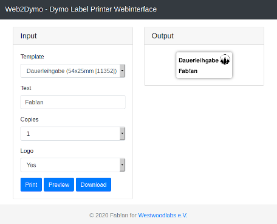

# Dymo Webinterface
Stuff, der im Space nicht beschriftet ist, gehört dem Space. Beschrifte also dein Zeug! Um es dir nicht zu schwer zu machen, haben wir dafür wir zwei Ettiketten Drucker, welche über ein komfortables Webinterface erreichbar sein. Dort gibt es ein paar Vorlagen z.B. für Dauerleihgaben oder mit Freitext.

## How to
* Webinterface unter https://dymo.wwlabs.space öffnen
* Vorlage auswählen
* Textfelder ausfüllen
* Ducker oder Vorschau anzeigen lassen
* Das Ettikett kommt je nach größe aus einem der beiden Drucker

## Nice to know
Die Webseite für die beiden Drucker läuft als Docker Container auf unserem Docker-Host nuc.wwlabs.space. Ein PHP Script stellt die Seite zur Verfügung. Das Ettiket wird als PDF an CUPS übergeben, der dieses auf einem der beiden Dymos druckt. Die Drucker hängen an einem USB-Device-Server und werden per RAW Socket vom CUPS angesprochen. Der Code für den Container [web2dymo-docker](https://github.com/Westwoodlabs/web2dymo-docker) ist in unseren [GitHub Repos](https://github.com/Westwoodlabs) zu finden.

hf&gl Fab!an
