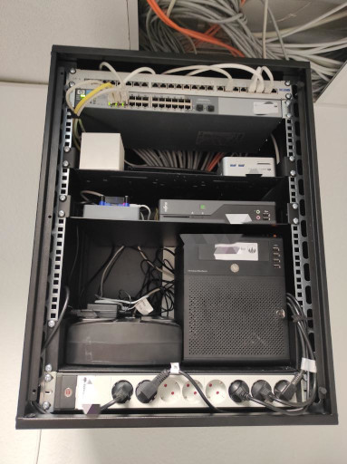

# Netzwerk

Hier dokumentieren wir ein paar Dinge zu unserer Space internen Netzwerk Infrastruktur. 

## DNS

| FQDN | Beschreibung | 
| ----------- | ----------- | 
| [strichliste.wwlabs.space](https://strichliste.wwlabs.space) | Strichliste, siehe [Projekt/Strichliste](Strichliste.md) | 
| [backend.wwlabs.space](https://backend.wwlabs.space) | Node-RED | 
| [dymo.wwlabs.space](https://dymo.wwlabs.space) | Dymo Webinterface, siehe [Projekt/Dymo](Dymo.md) | 
| [nuc.wwlabs.space](https://nuc.wwlabs.space) | Docker Host | 
| silex.wwlabs.space | Printer/USB-Device-Server | 
| tuer.wwlabs.space | Tür-Pi für Schließanlage, siehe [Projekt/Schliessanlage](Schliessanlage.md) | 

## VLANs

| id | Name |   | Wlan | 
| --- | --- | --- | --- | 
| 20 | WWL | für alles  | Westwoodlabs | 
| 30 | IoT | nur IoT Geräte  | Westwoodlabs-IoT | 
| 50 | Server | alle Server  | - | 
| 100 | extern | Netz zur Fritzbox | - | 
| 101 | FF | Freifunk | freifunk-ww.de | 

## Firewall

| In | Out | Protocol | Port | Action | 
| --- | --- | --- | --- | --- | 
| ALL | ALL | all | all | accept established,related | 
| ALL | ALL | ICMP | all | ACCEPT | 
| WWL | extern | all | all | ACCEPT | 
| WWL | Server | tcp | 22 | ACCEPT | 
| WWL | Server | tcp | 80 | ACCEPT | 
| WWL | Server | tcp | 443 | ACCEPT | 
| Server | IOT | all | all | ACCEPT | 
| IOT | Server | tcp | 1883 | ACCEPT | 
| ALL | ALL | all | all | drop | 
